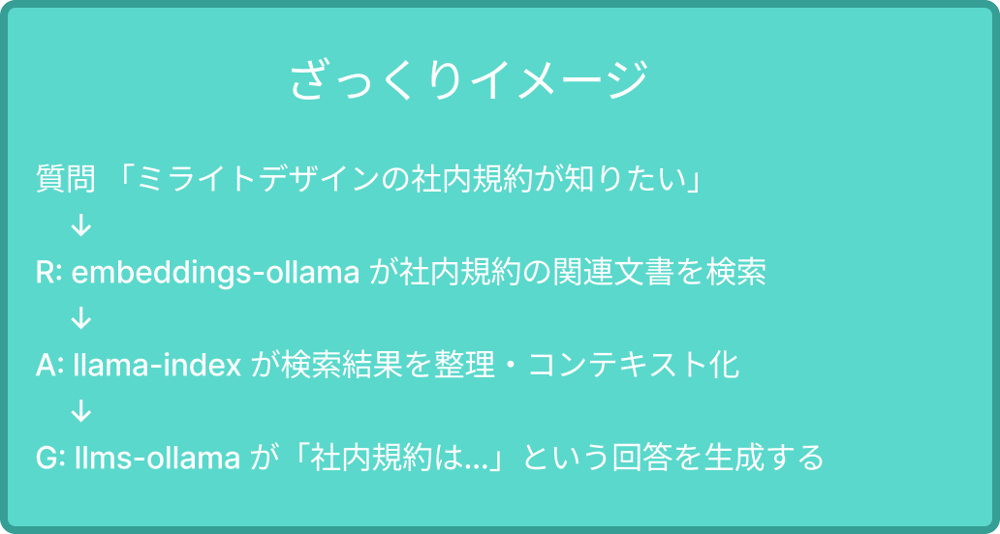

# 環境構築
::: warning 確認
**[事前準備](/guide/preparation)** が完了していない場合は先にそちらを済ませて下さい
:::

このセクションではpythonの実行環境を作っていきます。

ハンズオン当日はここから一緒に作業をしていきます。

## リポジトリの取得

ハンズオンで使うリポジトリを取得します

```bash
# リポジトリのクローン
git clone https://github.com/bucchi-kitamura/rag-hanzon.git
cd rag-hanzon
```

::: tip 📁 作業ディレクトリ
以降の作業は全てこのディレクトリ内で行います。
:::

## Python環境の構築

ハンズオンで使うPythonの実行環境を構築します。

### Python 3.13のインストール

```bash
uv python install 3.13
```

### 仮想環境の作成

```bash
uv venv --python 3.13
```

### 仮想環境の有効化

::: code-group

```cmd [Windows]
.venv\Scripts\activate
```

```bash [macOS/Linux]
source .venv/bin/activate
```

:::


`python --version`を実行して、同じバージョンであれば大丈夫です。
```bash
python --version
Python 3.13.3
```

## パッケージのインストール

ハンズオンで使うパッケージをインストールします。

インストールするパッケージは`pyproject.toml`に定義しています。
```bash
uv sync
```

今回は以下のパッケージを追加します。
- ruff（静的コード解析ツール）
- llama-index-embeddings-ollama
  - RAGのRetrieval（検索・取得）
  - 質問に関連するドキュメントやチャンクを検索・取得する
  - どの情報がユーザの質問に関連するかを見つけてくれる
- llama-index
  - RAGのAugmented（拡張・増強）
  - 検索で取得した情報を整理して、コンテキストとして拡張・増強する
- llama-index-llms-ollama
  - RAGのGeneration（生成）
  - 拡張したコンテキストを使って回答を生成する



::: info モデルの役割
[事前準備で用意してもらった2種類のモデル](/guide/preparation.html#%E3%83%A2%E3%83%86%E3%82%99%E3%83%AB%E3%81%AE%E3%82%BF%E3%82%99%E3%82%A6%E3%83%B3%E3%83%AD%E3%83%BC%E3%83%88%E3%82%99)は

`llama-index-llms-ollama`と`llama-index-embeddings-ollama`でそれぞれ必要になります
:::


### インストール確認
パッケージがインストールされたかを確認します


`uv tree`はパッケージの依存関係をツリー構造で表示するコマンドです
```bash
uv tree
Resolved 87 packages in 1ms
rag-hanzon v0.1.0
├── llama-index v0.12.43
# 大量に出るので略
```

補足
- 一覧見たい場合は `uv pip list`
- 特定パッケージの情報が見たい場合は `uv pip show llama-index`

## Ruffのコマンド

::: code-group

```bash [フォーマット]
uv run ruff format /src
```

```bash [規約チェック]
uv run ruff check /src
```

```bash [自動修正]
uv run ruff check /src --fix
```
:::

makeコマンド版

::: code-group

```bash [フォーマット]
make format
```

```bash [規約チェック]
make lint
```

```bash [自動修正]
make lint-fix
```

これでハンズオンの準備が完了しました。次のセクションへ移りましょう👉

:::