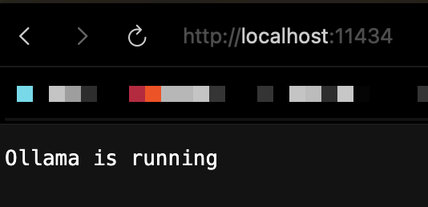

# ステップ1 チャット機能
RAGを使うためにはまずLLMと会話できるようにする必要があります。

まずはチャット機能を作っていきましょう


## ここでやること

まずはローカルからLLMと簡単なチャットを出来るようにします。

先ほどインストールした[llama-index-llms-ollama](/guide/setup.html#%E3%83%8F%E3%82%9A%E3%83%83%E3%82%B1%E3%83%BC%E3%82%B7%E3%82%99%E3%81%AE%E3%82%A4%E3%83%B3%E3%82%B9%E3%83%88%E3%83%BC%E3%83%AB)を使います。

## 準備

ファイルを作る
```bash
mkdir src && touch src/chat.py
```

src配下にファイルが出来ていればOK
```
rag-hanzon/
├── src/
    └── chat.py
```

Ollamaの起動を確認する

`http://localhost:11434/` にアクセスして下さい

Ollamaが起動していれば画像のように「Ollama is running」と表示


起動してなければサーバを起動しましょう
```bash
ollama serve
```


## コード部分
LLMと会話をするまでの大枠の構成は次の2ステップ
1. LLMに回答してもらう
2. プロンプトを入力できるようにする

::: code-group

```python [step-1]
# LLMに回答してもらう
from llama_index.llms.ollama import Ollama

def main():
    llm = Ollama(
        model="schroneko/gemma-2-2b-jpn-it"
    )

    response = llm.complete('富士山の標高は？')
    print(response)

if __name__ == "__main__":
    main()
```

```python [step-2.]
# プロンプトを入力できるようにする
from llama_index.llms.ollama import Ollama

def main():
    llm = Ollama(
        model="schroneko/gemma-2-2b-jpn-it"
    )

    while True:
        # ユーザーの入力待ち状態 ここでプロンプトを入力する
        user_input = input("あなた: ")

        # 終了条件 ユーザーが特定のキーワードを入力したら対話を終了する
        if user_input.lower() in ["exit", "終了"]:
            print("チャットボットを終了します。")
            break

        # 空の状態でEnterを押された場合はスキップする
        if not user_input.strip():
            continue
        response = llm.complete(user_input)
        # 応答の末尾に余分な空白文字が入ることがあるのでstripを使って削除する
        print(f"🤖: {response.text.strip()}\n")

if __name__ == "__main__":
    main()
```

:::

## 実行手順

### 1. プログラムの実行

```bash
python3 src/chat.py
```

### 2. 動作確認

::: tip 💡 実行結果例
```
> python3 src/chat.py
LLMと会話をする準備ができました。終了するには 'exit' と入力してください。

あなた: こんにちは
🤖: 考え中...
🤖: こんにちは！😊 何か用ですか？

あなた: Pythonについて教えて
🤖: 考え中...
🤖: Pythonは、1991年にグイド・ヴァンロッサムによって開発されたプログラミング言語です。

シンプルで読みやすい構文が特徴で、初心者にも学びやすい言語として人気があります。

あなた: exit
チャットボットを終了します。
```
:::

## まとめ

次のステップでは、チャット機能に**RAG**の仕組みを追加し、ローカルドキュメントの内容について回答できるようにします！

